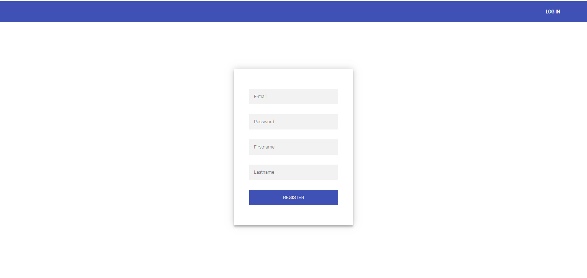
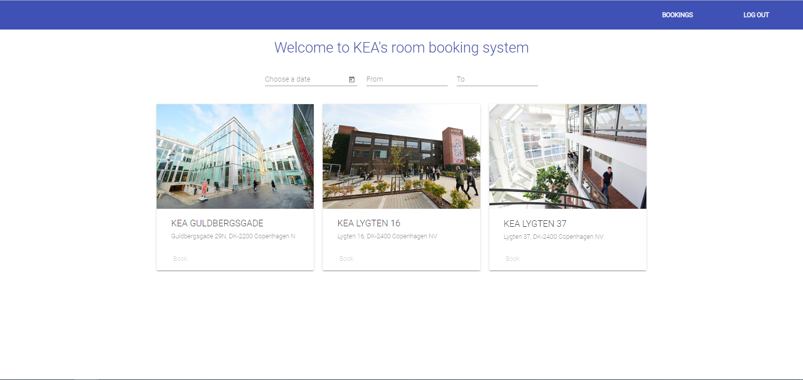
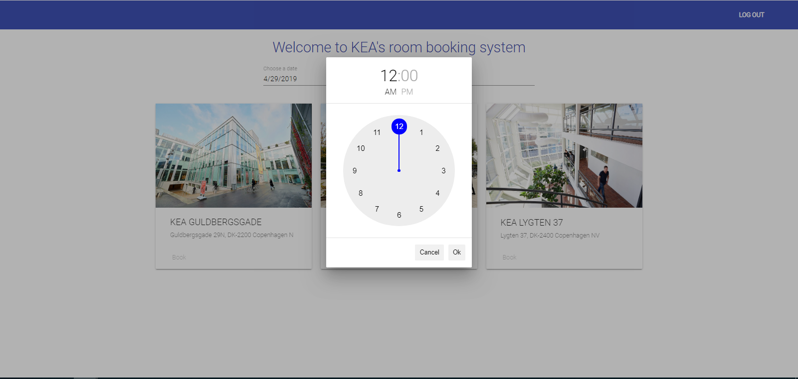
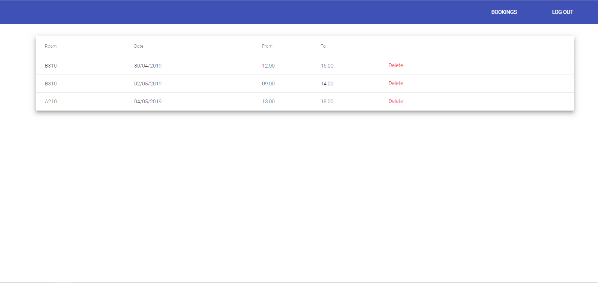

Kea Room Booking System
-----------------------------
This is the backend repository to a project developed for København's Erhvervsakademi.
The front-end repository can be found here: https://github.com/hajduboti/KEARoomBookingFrontend

--------------------------

The landing page is a login screen where the user can log in if he or she has
a KEA email address. If not, an account may be created by clicking 'Create Account'
--------------------------

The account creation page looks like above and requires an email address with a kea domain(@stud.kea.dk) and
takes a password, minimum 8 characters, and the users First and Last Name
--------------------------

If the user logs in successfully, they are greeted to a screen showing various
KEA campuses. For the moment we have only implemented the functionality for KEA's campus
at Guldbergsgade 29E. You must enter a date and a start/end time for the booking.
The time must be between 08.00 and 22.00, the hours of operation at KEA.
--------------------------

The widget for picking the time and date comes from [this](https://www.npmjs.com/package/amazing-time-picker) dependency.

--------------------------

Once the user selects their time, they are shown a map of the campus with all rooms. For the first iteration 
the user can only view the second floor of the Guldbergsgade campus, and in future iterations we plan to make the floor level
scrollable. The map is an SVG vector map so it scales to all resolutions and to select a room the user simply
clicks on the room they wish to book. Rooms can not be double booked and a user can not book a room at the same time they have another
booking for another room.

--------------------------

The confirmation box pops up after a room is selected and here the user can confirm or decline their booking

--------------------------

Lastly, the user may view all of their current, previous, and future bookings in the 'Bookings' tab. If they wish, they
can delete any of the bookings so long as it is not within 24 hours of the date.

